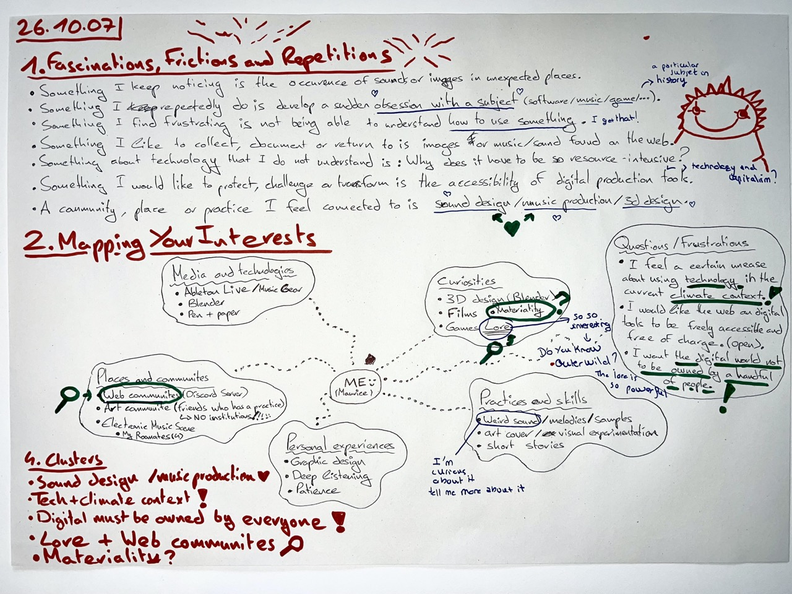

# 𖥋 Process 𖥋

This folder contains various notes, references, sketches, images, ideas, etc.  
Each entry is dated and arranged in reverse chronological order.

# 𖨠 26.10.07 - Designing questions & reflections 𖨠   (w/ Alexia Mathieu) 

We worked on [exercises](https://hessoit.sharepoint.com/:b:/r/sites/26-27MAMediaDesign/Documents%20partages/md1_%20designing%20questions/Presentations/Wed%2007.10/Designing%20questions_reflections.pdf?d=w09b4cac247b74776a8987bea3f06f15c&csf=1&web=1&e=n6mMdg) proposed by Alexia, focusing on the concepts of fascination, friction, and repetitiveness within our areas of interest.

→ For <u> October 26, 2026 </u>, try to do exercise 5 from the PDF: 

- I am interested in exploring ___. 
- The context, community, place, material or practice I want to engage with is ___. 
- I am curious about the relationship, contradiction or tension between ___ and ___. 
- I think this matters because ___. 
- I could investigate this by observing ___, speaking with ___, collecting or documenting 
___, or making/prototyping ___. 
- This could help me understand ___. 
- My first small experiment could be ___